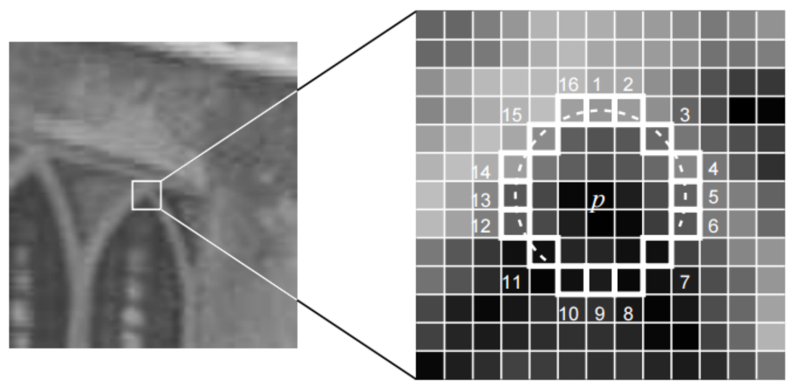
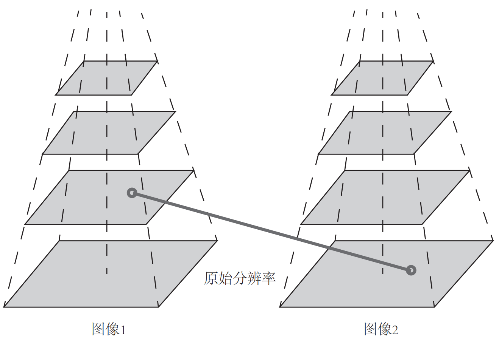

&emsp;
# FAST 关键点
## 1 Intro
FAST 是一种角点, 主要检测局部像素灰度变化明显的地方, 以速度快著称。它的思想是: 如果一个像素与邻域的像素差别较大 (过亮或过暗), 那么它更可能是角点

相比于其他角点检测算法, FAST 只需比较像素亮度的大小, 十分快捷。它的检测过程如下:
1. 在图像中选取像素 $p$, 假设它的亮度为 $I_p$ 。
2. 设置一个阈值 $T$ ( 比如, $I_p$ 的 $20 \%$ )。
3. 以像素 $p$ 为中心, 选取半径为 3 的圆上的 16 个像素点。
4. 假如选取的圆上有连续的 $N$ 个点的亮度大于 $I_p+T$ 或小于 $I_p-T$, 那么像素 $p$ 可以被认为是特征点 ( $N$ 通常取 12, 即为 FAST-12。其他常用的 $N$ 取值为 9 和 11 , 它们分别被称为 FAST-9 和 FAST-11)。
5. 循环以上四步, 对每一个像素执行相同的操作

    

&emsp;
## 2 FAST-12
在 FAST-12 算法中, 为了更高效, 可以添加一项预测试操作, 以快速地排除绝大多数不是角点的像素。具体操作为, 对于每个像素, 直接检测邻域圆上的第 $1,5,9,13$ 个像素的亮度。只有当这 4 个像素中有 3 个同时大于 $I_p+T$ 或小于 $I_p-T$ 时, 当前像素才有可能是一个角点, 否则应该直接排除。这样的预测试操作大大加速了角点检测。此外，原始的 FAST 角点经常出现 “扎堆” 的现象

FAST 特征点的计算仅仅是比较像素间亮度的差异所所以速度非常快, 但它也有重复性不强, 分布不均匀的缺点。此外, FAST 角点不具有方向信息。同时, 由于它固定取半径为 3 的圆, 存在尺度问题：远处看着像是角点的地方，接近后看可能就不是角点了。针对 FAST 角点不具有方向性和尺度的弱点, ORB 添加了尺度和旋转的描述。尺度不变性由构建图像金字塔®, 并在金字塔的每一层上检测角点来实现。而特征的旋转是由灰度质心法 (Intensity Centroid) 实现的。

&emsp;
## 3 图像金字塔

    

&emsp;

金字塔时计算图视觉中常用的一种处理方法。金字塔底层是原始图像。每往上一层, 就对图像进行一个固定倍率的缩放, 这样我们就有了不同分辨率的图像。较小的图像可以看成是远处看过来的场景。在特征匹配算法中，我们可以匹配不同层上的图像，从而实现尺度不变性。例如，如果相机在后退，那么我们应该能够在上一个图像金字塔的上层和下一个图像的下层中找到匹配。

在旋转方面, 我们计算特征点附近的图像灰度质心。所谓质心是指以图像块灰度值作为权重的中心。其具体操作步骤如下:
1. 在一个小的图像块 $B$ 中, 定义图像块的矩为
$$
m_{p q}=\sum_{x, y \in B} x^p y^q I(x, y), \quad p, q=\{0,1\}
$$

2. 通过矩可以找到图像块的质心:
$$
C=\left(\frac{m_{10}}{m_{00}}, \frac{m_{01}}{m_{00}}\right) .
$$
3. 连接图像块的几何中心 $O$ 与质心 $C$, 得到一个方向向量 $\overrightarrow{O C}$, 于是特征点的方向可以定义为
$$
\theta=\arctan \left(m_{01} / m_{10}\right) .
$$

通过以上方法, FAST 角点便具有了尺度与旋转的描述, 从而大大提升了其在不同图像之间表述的鲁棒性。所以在 ORB 中, 把这种改进后的 FAST 称为 Oriented FAST。